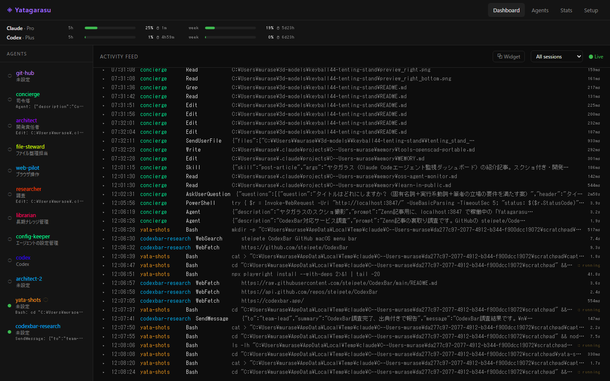
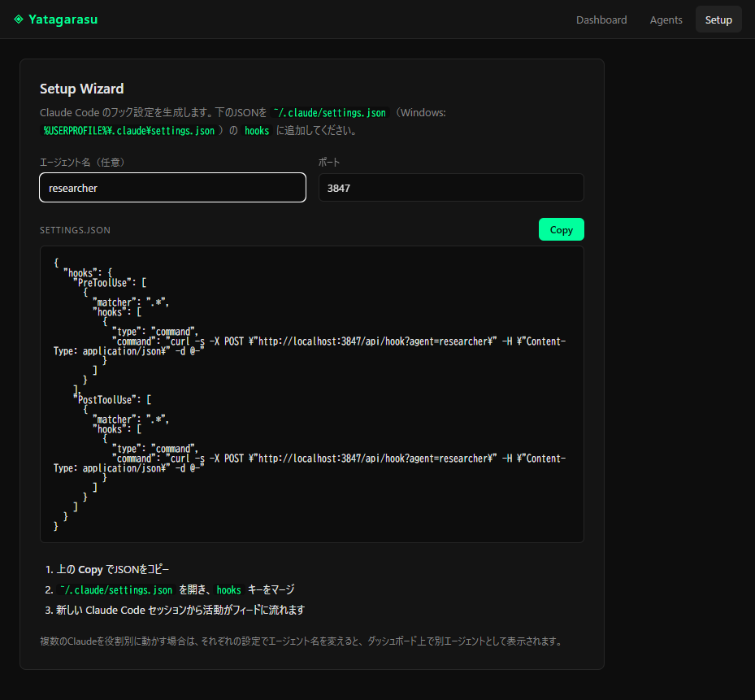
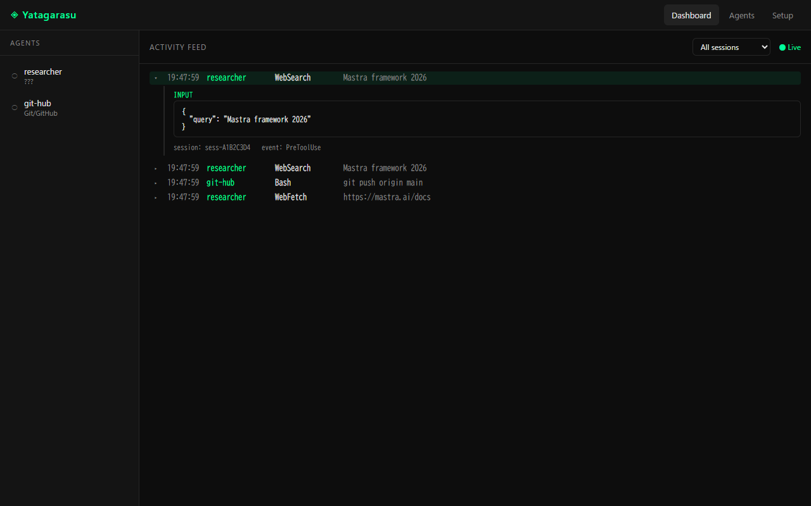
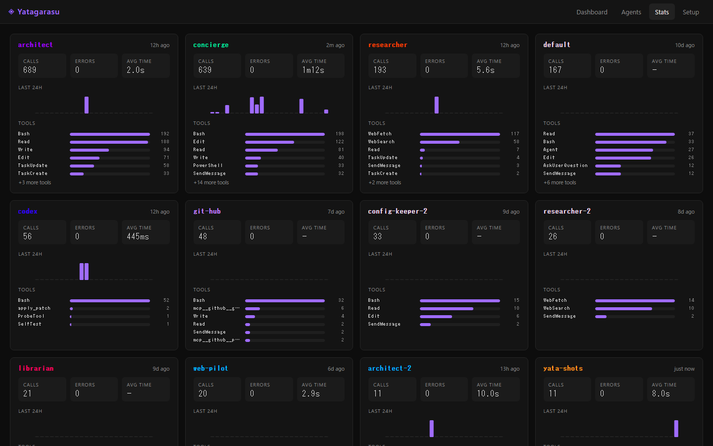
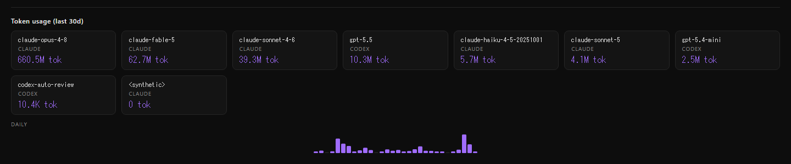
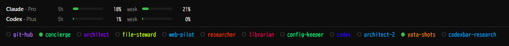

# 🐦‍⬛ Yatagarasu（八咫烏）

> Claude Code / Codex のエージェント群をリアルタイムで監視する、ローカル開発ダッシュボード

[](https://github.com/masa5228/yatagarasu/actions/workflows/ci.yml)
[](LICENSE)

Claude Code や Codex のフック経由でエージェントの活動を受信し、ターミナルの横に並べて使うダッシュボードです。
「ログを流すだけ」の既存ツールと違い、**エージェントを名前・役割つきで登録して "チームメンバー表" のように管理**できるのが差別化ポイントです。

活動フィードに加えて、**サブスクのレート枠（あと何回叩けるか）** ・ **ローカルログから集計したトークン消費** ・ **常に最前面の小窓（ウィジェット）** まで、ターミナル作業中に横目で見たい情報をまとめて出せます。

📝 紹介記事: [ターミナルの横に置く、AIエージェント監視ダッシュボード「八咫烏」をつくった](https://zenn.dev/muramasa0228/articles/2026-07-09-yatagarasu-agent-dashboard)



---

## ✨ 特徴

### エージェント監視

- **リアルタイム活動フィード** — フックで届くツール呼び出しを WebSocket で即時表示（`tail -f` 的に下から積み上がる）
- **ステータス表示** — `PreToolUse`／`PostToolUse` をツール実行単位でペアリングし、`◌ running` → 完了（所要時間）／`✕ error` を色分け表示。エラー行はハイライト
- **エージェント管理** — 名前・役割・説明・アクセントカラーを登録。直近60秒の活動有無で稼働状態（⬤ / ○）を可視化。フィード上でもエージェント色で識別
- **ツール詳細ビュー** — ログ行クリックで `tool_input` / `tool_result` を整形 JSON で展開
- **セッション絞り込み** — `session_id` 単位でフィードをフィルター
- **Stats ページ** — エージェント別に「呼び出し数・エラー数・平均所要時間・直近24hのスパークライン・ツール別内訳」を集計表示
- **テーマカラー選択** — アクセント色を8色から選択（デフォルトはストラクチュラル・バイオレット、玉虫色グラデもあり）。**稼働/正常（緑）・警告（黄）・異常（赤）のステータス色はどのテーマでも固定**

### 使用量・コスト（CodexBar 由来）

- **UsageBar（レート枠）** — ダッシュボード上部に Claude / Codex のセッション枠（5h）・週次枠を横断表示。使用率で緑/黄/赤、リセットまでのカウントダウン付き
- **CostPanel（ローカルコスト）** — Claude / Codex のセッション JSONL を増分スキャンし、モデル別・日別のトークン消費を Stats ページ下部に表示（**トークン数のみ・ドル換算なし**）
- **ウィジェットモード** — Document Picture-in-Picture API で、レート枠バー＋エージェント稼働ランプだけの小窓を常に最前面に表示

### ローカル完結

- 活動データは `~/.yatagarasu/` の SQLite に保存（既定30日で自動パージ）。外部に送信しません
- 外向き通信は UsageBar のレート枠取得のみ。**ローカルの OAuth トークンで残量を read するだけ**（推論トークン非消費・API キー不使用・トークン等の秘匿情報は保存/表示/ログ出力しない）

---

## 📦 インストール

```bash
# npm 公開後
npm install -g yatagarasu
yata start

# ソースから
git clone https://github.com/masa5228/yatagarasu.git
cd yatagarasu
npm install
npm run build
npm start
```

`yata start` 後、ブラウザで **http://localhost:3847** を開きます。ポート 3847 は八咫烏の語呂合わせです（語呂合ってない）。

---

## 🚀 使い方

### 1. 起動

```bash
yata start              # デフォルトポート 3847
yata start --port 4000  # ポート変更
```

### 2. フックを結線する（Claude Code / Setup ウィザード）

ダッシュボードの **Setup** タブを開き、フック設定 JSON を生成して `~/.claude/settings.json`
（Windows: `%USERPROFILE%\.claude\settings.json`）の `hooks` にマージします。



生成される設定はこの形です（エージェント名 `researcher` を指定した例）:

```json
{
  "hooks": {
    "PreToolUse": [{ "matcher": ".*", "hooks": [{ "type": "command",
      "command": "curl -s -X POST \"http://localhost:3847/api/hook?agent=researcher\" -H \"Content-Type: application/json\" -d @-" }] }],
    "PostToolUse": [{ "matcher": ".*", "hooks": [{ "type": "command",
      "command": "curl -s -X POST \"http://localhost:3847/api/hook?agent=researcher\" -H \"Content-Type: application/json\" -d @-" }] }]
  }
}
```

> 💡 **エージェント別に分けたいとき**: 役割ごとに Claude を動かすなら、それぞれの設定で `?agent=` の名前を変えてください。ダッシュボード上で別エージェントとして並びます。Claude Code の標準フックには エージェント識別子が含まれないため、この `?agent=` クエリで識別子を補います。
>
> 💡 **司令塔（リードセッション）を識別したいとき**: `CLAUDE_CODE_EXPERIMENTAL_AGENT_TEAMS` 環境などでトップ階層のリードセッションは名前を持たず `default` に落ちます。グローバルフックの末尾に **`?fallback=<ラベル>`** を付けると、他で識別できないセッションだけにそのラベルが付きます（`?agent=` と違い最低優先度なので、サブエージェントの名前は塗り潰しません）。

### 3. フックを結線する（Codex）

Codex CLI のフック（コマンド実行）からも、同じ `/api/hook` に POST すれば取り込めます。エージェント識別のため **`?agent=codex`** を付けます。

```bash
curl -s -X POST "http://localhost:3847/api/hook?agent=codex" -H "Content-Type: application/json" -d @-
```

> ⚠️ **Windows（PowerShell）での注意**:
> - `curl` は PowerShell だと `Invoke-WebRequest` のエイリアスなので、**`curl.exe`** と実体名で呼ぶこと
> - stdin を渡す `-d` は **`-d "@-"`** とクオートする（`@-` がそのまま解釈されないように）
> - 応答ボディは不要なので **`-o NUL`** で破棄する
> - Codex 側で**フックコマンドの trust 登録**が必要
>
> Windows 用の例:
> ```powershell
> curl.exe -s -X POST "http://localhost:3847/api/hook?agent=codex" -H "Content-Type: application/json" -d "@-" -o NUL
> ```

> 💡 **WSL 側の Codex から送るとき**: WSL からホスト（Windows）で動く Yatagarasu へは `localhost` ではなくデフォルトゲートウェイの IP 宛に POST します（例: `ip route` の `default` 行の IP を使う）。

### 4. 監視する

Claude Code / Codex を操作すると、左サイドバーで稼働状態、右ペインで活動ログがリアルタイムに更新されます。
ログ行をクリックすると入力／結果の詳細が展開されます。



---

## 📊 使用量・コスト・ウィジェット（CodexBar 由来）

2026-07 の大型アップデートで、macOS メニューバーアプリ [**CodexBar**（steipete/CodexBar, MIT）](https://github.com/steipete/CodexBar) の主要機能を Node.js / React で再実装しました。本家は50社超のサービスに対応していますが、Yatagarasu は**作者が使う Claude / Codex の2つだけ**を実装しています。

### UsageBar（レート枠）

ダッシュボード上部に、サブスクの残量を横断ストリップで表示します。

- **Claude**: `~/.claude/.credentials.json` の OAuth トークンで使用量 API（`oauth/usage`）を read。5時間枠・週次枠・モデル別枠
- **Codex**: `codex app-server` の JSON-RPC（`account/rateLimits/read`）でセッション枠・週次枠を取得。RPC が失敗した場合は ChatGPT の使用量 HTTP エンドポイントにフォールバック
- 使用率で緑（<70%）/黄（70–90%）/赤（>90%）、リセットまでのカウントダウン（`↺ 4h27m`）

> 🔒 いずれも **read 専用・API キー不使用・課金経路なし**。Codex は子プロセスから `OPENAI_API_KEY` を除去して起動します。取得したトークンや PII（メール等）は保存・表示・ログ出力しません。

### CostPanel（ローカルコスト）



Stats ページ下部に、ローカルログから集計したトークン消費を表示します。



- `~/.claude/projects/**/*.jsonl` と `~/.codex/sessions/**/*.jsonl` を**増分スキャン**（追記分のみ・`~/.yatagarasu/cost-cache.json` にサイドカーキャッシュ）
- モデル別タイル（総トークン・内訳は tooltip）＋日別トークンのスパークライン
- **ドル換算はしない**（トークン数のみ）

### ウィジェットモード



フィード右上の **⧉ Widget** ボタンで、Document Picture-in-Picture の小窓をポップアウト。レート枠バーとエージェント稼働ランプだけを**常に最前面**に表示し続けます。ターミナル作業中でも視界の隅で残量とエージェントの生死を把握できます。

> 対応ブラウザは Chrome / Edge 116+。未対応（Firefox / Safari 等）ではボタンが表示されません（Web に常時最前面 API が無いため）。既存ダッシュボードは通常どおり使えます。

---

## ⚙️ 設定

| 項目 | デフォルト | 変更方法 |
|------|-----------|---------|
| ポート | `3847` | `yata start --port <N>` |
| DB ファイル | `~/.yatagarasu/yatagarasu.sqlite` | 環境変数 `YATA_DB_PATH`（`:memory:` 可） |
| 活動の保持期間 | 30日（起動時に自動パージ） | — |
| レート枠のポーリング間隔 | 60秒（クライアント表示は45秒） | 環境変数 `YATA_USAGE_POLL_MS`（下限クランプあり） |

---

## 🛠️ 開発

```bash
npm install
npm run dev        # API(3847) + Vite(5173, /api・/ws を proxy)
npm run typecheck  # サーバー/クライアント両方の型チェック
npm run build      # サーバー(tsc) + クライアント(vite) をビルド
```

### テスト

```bash
npm test           # Vitest（107テスト / 21ファイル）
npm run test:watch
npm run test:coverage
```

DB層・HTTP ルート（フック受信／エージェント CRUD／活動一覧／Stats／usage／cost）・WebSocket 配信・ウィザード生成・
レート枠マッピング・コストスキャナ・クライアント側の純粋関数（レート枠色分け・稼働判定）・Document PiP のスタイル注入までを
Vitest + supertest でカバーしています（カバレッジしきい値 stmts 85 / branches 75 / funcs 90 / lines 85）。
push / PR で GitHub Actions が typecheck・カバレッジ・ビルドを実行します。

> ℹ️ テストは Node 22 以上が必要です（WebSocket クライアントに Node 組み込みの `WebSocket` を使用）。DOM を要するクライアントテストはファイル単位で jsdom 環境に切り替えています。

---

## 🧱 技術スタック

| 役割 | 技術 |
|------|------|
| フック受信・API サーバー | Node.js + Express |
| データ保存 | SQLite（better-sqlite3）|
| リアルタイム通信 | WebSocket（ws）|
| レート枠取得 | Codex app-server JSON-RPC / OAuth 使用量 API（read-only）|
| フロントエンド | React + Vite + TypeScript |
| ウィジェット | Document Picture-in-Picture API |
| スタイリング | CSS Modules |
| テスト | Vitest + supertest + jsdom |

---

## 📁 プロジェクト構成

```
bin/yata.ts              # CLI エントリ（yata start）
src/
  server/
    index.ts             # createApp() / startServer()
    routes/              # hooks・agents・activities・stats・usage・cost
    db/                  # SQLite 接続・スキーマ・マイグレーション
    usage/               # レート枠フェッチ（claude/codex）・コストスキャナ・ポーラ・サイドカーキャッシュ
    ws.ts                # WebSocket 配信ハブ
  client/
    pages/               # Dashboard・Agents・Stats・Setup
    components/          # AgentList・ActivityFeed・ActivityDetail・UsageBar・CostPanel・Widget・ThemePicker
    hooks/               # useWebSocket・useUsage・useDocumentPip
    lib/                 # api・hookSnippet・usage・agentStatus・agentColors・summarize・theme・copyStyles
docs/design/             # 設計書（usage-limits・widget-mode・lead-session-identification）
tests/                   # Vitest テスト（21 ファイル / 107 テスト）
```

---

## 🗺️ ロードマップ

- [x] **MVP1** — フック受信サーバー / リアルタイム活動フィード / エージェント登録
- [x] **MVP2** — セットアップウィザード / ツール詳細ビュー / セッション別グルーピング
- [x] **監視強化** — ステータス・所要時間・エラー色分け / Stats ページ / テーマカラー選択
- [x] **CodexBar 機能移植** — レート枠（UsageBar）/ ローカルコスト（CostPanel）
- [x] **ウィジェットモード** — Document Picture-in-Picture の常時最前面小窓
- [x] **Codex 対応** — `?agent=codex` フックからの活動取り込み
- [ ] npm 公開
- [ ] 通知・履歴の検索など

---

## 🙏 クレジット

- **[CodexBar](https://github.com/steipete/CodexBar)**（steipete, MIT）— レート枠・ローカルコスト・常時最前面ウィジェットの各機能は、CodexBar の再実装です。

---

## 📄 ライセンス

[MIT](LICENSE) © masa5228
